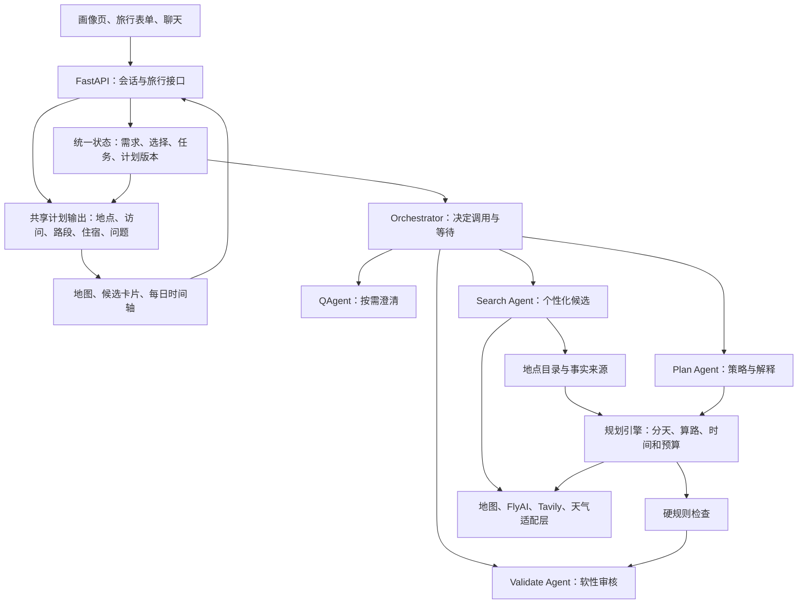
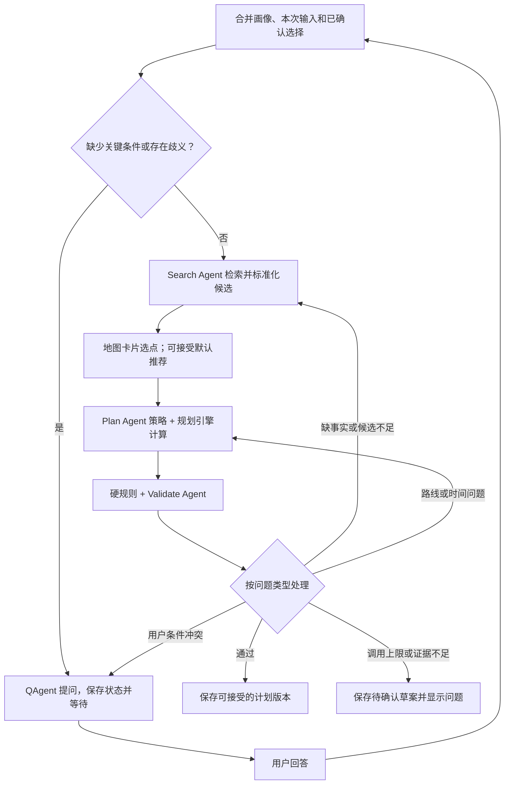
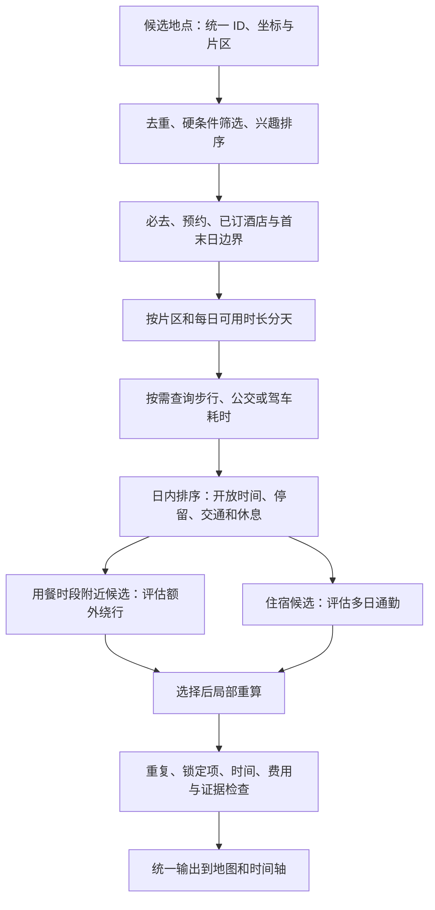

# 已选 B 版：地图与卡片共同规划架构

状态：用户已选择 B；本文是具体改造设计，尚未实施。日期：2026-09-29。

## 1. 职责边界

保留 QAgent、Search Agent、Plan Agent、Validate Agent 四个模型角色。Orchestrator 是状态编排器，地图适配、实体匹配、排名、路线优化和规则校验是程序服务，不必各自再加一个模型。

| 模块 | 输入与输出 | 核心职责 |
|---|---|---|
| QAgent | 需求/缺口/候选/冲突 → 问题及结构化回答建议 | 搜索前澄清，选点时辅助取舍，无法自动解决冲突时提问；信息够就跳过 |
| Search Agent | TripIntent、搜索范围和缺口 → CandidateSet | 多类型/多片区召回、事实取证、定向补搜；供应商调用可由确定性程序执行 |
| Plan Agent | 需求、候选、选择、路线计算结果 → 规划策略、替代方案、解释 | 提出候选和节奏建议；通过规划引擎生成日程，不自行编造 ID、交通或价格 |
| Validate Agent | 计划、事实、规则结果 → 软性意见和问题分类 | 检查兴趣适配、舒适性、推荐理由；不能把硬规则失败或未知覆写为通过 |
| Orchestrator | 持久化状态与用户事件 → 下一步任务 | 控制等待、恢复、补搜、重排、预算和版本；不是第五个自由决策模型 |

## 2. 整体逻辑架构



图为逻辑职责而非部署拓扑。模块的执行结果由编排器写回统一状态。先维持模块化单体；后台任务可使用独立 worker，不预先拆成多个微服务。

## 3. Agent 编排流程



补搜和修复只针对问题范围；初期建议最多两次自动修复作为可配置起点，同时有总耗时/外部调用上限。用户后续回答触发新一次任务，不算自动无限重试。正常首次生成或修改预览不需要用户为每个内部工具调用确认。

QAgent 取消固定 4–6 题。字段完整性由程序判断；模型提出少量有决策价值的问题。回答映射回明确字段或地点 ID，保留来源；纯点击候选可以直接更新状态，不强制经过 QAgent。已有明确选择不重复询问。

## 4. 用户画像如何录入与使用

分开存储：

| 层次 | 内容 | 更新方式 |
|---|---|---|
| UserProfile 长期偏好 | 兴趣、常用交通、节奏、餐饮和住宿偏好 | 用户编辑画像页；对话提取的长期偏好先作为建议，经确认后保存 |
| TripIntent 本次需求 | 城市/日期、同行人、预算、到达离开、必去/排除、本次特殊需求 | 表单、聊天及 QAgent 回答更新；不自动覆盖长期画像 |
| Selection 当前选择 | 候选 ID、必去/可选/排除、酒店、锁定日期/时段 | 地图和卡片直接更新，聊天修改也写同一对象 |

本次明确要求优先于长期偏好；同次旅行相互冲突的硬条件应询问，不用简单最后写入覆盖。每个字段保留 source、confirmed、updated_at；推测值与用户确认值分开，模型推测不能直接升级成硬约束。不从年龄/性别直接推断体力与兴趣，应询问相关旅行需求。

登录用户由后端读取画像，并在本次旅行开始时保存所用画像版本/快照；后续修改长期画像不静默重排既有旅行。未登录用户使用匿名旅行草稿，后续可迁移到账号。浏览器缓存只作恢复辅助，不作为唯一事实源。生产账号身份需要真实认证与资源所有权检查，不能只信前端 user_id。

当前 ProfilePage 已有 localStorage 和 saveProfile；应改为加载/保存后端状态并区分保存成功与本地草稿。TripSurveyPage 增补交通、到达离开等字段，确保所有显示收集的字段进入后端契约，避免只存前端。

## 5. 地图参与规划的具体算法流程



Plan Agent 先给出推荐候选、体验节奏或方案目标；引擎决定实际可行的日期与顺序，再把计算结果交给模型解释。说明文本不得改变引擎已确认的 ID、时间、报价或路线。

已订酒店先锁定；未定酒店用住宿片区作为明确标记的临时锚点，推荐少量酒店后回算多天起终点。默认单酒店，用户明确要求才拆分住宿。餐馆按饭点附近/两景点之间检索，酒店按多日整体交通评估，不套同一距离排名。

程序先保证硬约束，再在可行方案中比较兴趣覆盖、通勤、步行、折返、费用和节奏。用户尚未确定 rank 公式，因此保留分项指标与 ranking_version，不假定权重。OR-Tools 可用于更复杂时间窗，但不是接入后自动解决旅游建模；初期片区分组和局部排序也需完整规则检查。

路线服务接收起终点、模式、时段，返回 duration、distance、steps、polyline、source、fetched_at。交通方向可能不对称；不同模式分别计算。直线距离只作候选初筛。未知时长不能作为零分钟，路线失败不能由模型虚构替代。供应商不支持目标日期预测时，应标为查询时估算。

## 6. 后端状态与前端输出

核心状态：profile_snapshot、trip_intent、pending_questions、candidates、selections、route_cache_refs、plan_versions、validation、job_status。以 trip/session 为标识持久化，任务结果带 base_version，拒绝过期任务覆盖新选择。

前端地图、卡片和时间轴共同读取 PlanVersion：

```text
PlanVersion
  places: 地点 ID、名称、坐标、类型、供应商映射
  days[].visits: 地点 ID、起止时间、停留时长、锁定状态
  days[].legs: 起终点 ID、方式、耗时、距离、路线几何、来源
  stays: 酒店 ID、入住退房、报价口径、人数/房数
  cost_summary: 已知金额、未知项目、币种
  validation: passed / failed / unknown，具体问题
  change_summary: 与父版本的差异
```

新增规划任务状态 planned/searching/awaiting_answer/awaiting_selection/planning/validating/ready/needs_attention/failed/cancelled 等应在实现时收敛为明确枚举，避免前端从文本猜进度。首次候选选择可由用户接受默认推荐推进；QAgent 的问题需带 resume_token/状态版本以防旧回答误用。

## 7. 修改方向与优先级

| 优先级 | 模块 | 修改方向 | 规模 |
|---|---|---|---|
| P0 | 画像与需求契约、后端状态 | 区分长期/本次/选择，来源和版本；前端所有输入真实传到后端 | 中到大 |
| P0 | QAgent | 按缺口调用、问题带目标字段/候选 ID；结构化答案；暂停/恢复 | 中 |
| P0 | Search Agent | 接 TripIntent；多路召回、实体标准化、过滤、事实来源、按缺口补搜 | 大 |
| P0 | 地图适配、地点与路线模型 | 查点、坐标系、周边、路线、缓存与失败状态 | 核心新增 |
| P0 | Plan Agent 与规划引擎 | 策略/解释与确定性计算分开；按区域/时间/路线排程 | 大 |
| P0 | Validate 兜底 | 删除无效输出默认通过；硬规则不可被软审核覆盖 | 小 |
| P1 | React 工作区 | 卡片/地图/每日安排共享状态；锁定、局部修改、预览、撤销 | 大 |
| P1 | 餐饮住宿 ranking | 餐馆绕行与酒店多日通勤分开；预留公式；未知报价可见 | 中 |
| P1 | Orchestrator 完整反馈 | 有限补搜/重排、冲突交 QAgent、持久任务与取消 | 大 |

实施按端到端里程碑，而非先做完所有 Agent 再集成：

1. 地图接入试验 + 统一需求/地点契约。
2. QAgent 澄清 → 个性化搜索 → 地图候选可见。
3. 用户选点 → 分天与交通计算 → 规则检查 → 可恢复的版本。
4. 餐饮住宿选择 → 局部重算 → 预览与撤销。
5. 完整补搜/冲突反馈与固定回归验收。

上海验收：同实体默认不重复、豫园/城隍庙优先同日、必去和排除被执行、路线有来源、换酒店后各日路线更新、冲突不偷偷解决、刷新恢复、后到达的旧任务不覆盖新选择。具体路线和餐馆不能在缺少实时查询时预先当作已验证结果。

## 8. 保留与迁移

保留 React/FastAPI/LangGraph 与现有供应商接入；逐步把子进程调用迁为有类型的服务函数/worker，避免一次性进程内存承担用户会话。旧 Trip 和旧 /plan 可保留兼容，新增结构化计划版本，旧文本地点标为待匹配，不自动猜测同名实体。

本设计细化并补充 `map-planning-options-2026-09-29.md` 的 B 版，尤其明确了 QAgent 的作用。排名公式、地图账号权限与可用字段仍为后续实施输入；开发时不把这些未知项伪装成已经接入。
