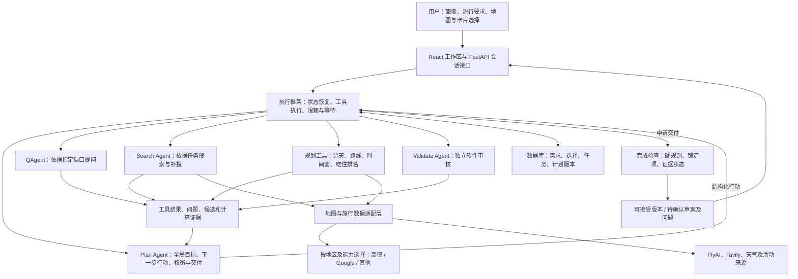

# Plan Agent 主导的旅行规划：执行蓝图与地图选型

2026-09-29；状态：P0 国内基础与 P1 最小编排已实现；94 项后端测试通过。上海真实问答循环与上海→北京真实候选任务已执行。当前实现 Plan/Q、Search 地图工具及可恢复会话；路线引擎与完整 Validate 在 P2，规划地图页面在 P3。用户明确先做国内，海外移至后续阶段。当前阶段的具体架构及证据见 docs/p1/implementation-plan.md、docs/p1/execution-report.md。

本文是后续实施的最新基线，替代 `architecture-b-selected.md` 中由 Orchestrator 决定业务步骤的设计。保留 B 的地图/卡片共同规划体验，调整为 Plan Agent 统筹、程序约束执行。

## 1. 架构图：决策权、执行权、计算职责分开



执行框架的分支只处理 ask/tool/finish 等行动类型和程序约束，不规定先搜索酒店还是先搜索景点。工具结果回到 Plan Agent，由它决定下一步。完成检查失败会把问题作为观察返回；达到预算上限则保存 needs_attention 状态，而不是无限让模型自我修复。

四个 Agent：Plan 负责全局，Q 负责有价值的提问，Search 负责候选和证据，Validate 负责独立软审核。路线求解、去重和硬规则是确定性工具。无需再引入一个“地图 Agent”。

## 2. 项目树：目标结构与每个文件的职责

以下是拟新增/重构的核心文件，未列出的既有登录、目的地等页面保持原结构。`__init__.py` 仅导出模块，不承载业务。不创建空壳或提前搬迁目录；按里程碑落地。

```text
Travel-Agent/
├─ backend/
│  ├─ app/
│  │  ├─ main.py                         # 修改：注册新接口和应用生命周期
│  │  ├─ config.py                       # 修改：模型/地图配置、限额；读取环境变量
│  │  ├─ db.py                           # 保留扩展：数据库连接与会话
│  │  ├─ api/routes/
│  │  │  ├─ profile.py                   # 修改：服务端画像读写，返回保存状态
│  │  │  ├─ sessions.py                  # 新增：发起任务、提交回答/编辑、查询进度、取消
│  │  │  ├─ candidates.py                # 新增：获取候选、保存选择，不直接决策
│  │  │  ├─ plans.py                     # 新增：版本读取、接受预览、撤销
│  │  │  └─ plan.py                      # 兼容：旧入口委托新服务，不继续维护两套逻辑
│  │  ├─ schemas/
│  │  │  ├─ intent.py                    # TripIntent、偏好/硬条件、字段来源和确认状态
│  │  │  ├─ place.py                     # Place、ProviderRef、坐标系、事实与来源
│  │  │  ├─ plan.py                      # Visit、RouteLeg、Stay、版本与费用口径
│  │  │  ├─ action.py                    # AgentAction、ToolResult、合法动作参数
│  │  │  └─ session.py                   # SessionState、问题、任务和进度事件
│  │  ├─ agents/
│  │  │  ├─ client.py                    # 共用模型客户端、结构化输出和错误归一化
│  │  │  ├─ plan_agent.py                # 全局统筹：根据状态选择动作、比较结果、提出交付
│  │  │  ├─ question_agent.py            # 根据具体缺口生成少量问题和可绑定选项
│  │  │  ├─ search_agent.py              # 多路检索计划、证据整理、缺口补搜
│  │  │  ├─ validate_agent.py            # 软审核：偏好、舒适度、理由与事实一致性
│  │  │  └─ prompts.py                   # 四个角色的提示词和版本标识
│  │  ├─ runtime/
│  │  │  ├─ graph.py                     # 可选后续 LangGraph 适配；P1 实际采用异步动作循环
│  │  │  ├─ executor.py                  # 后台任务、恢复、取消、超时和检查点
│  │  │  ├─ guards.py                    # 参数、权限、调用预算、旧版本和完成条件检查
│  │  │  ├─ store.py                     # P1 已实现：SQL版本、幂等、租约、限额、事件
│  │  │  └─ events.py                    # 后续可拆分事件接口；P1 事件在 store 中实现
│  │  ├─ tools/
│  │  │  └─ registry.py                  # 工具白名单、输入输出类型与服务函数绑定
│  │  ├─ services/
│  │  │  ├─ intent_service.py            # 合并画像、本次要求、回答及选择；识别冲突
│  │  │  ├─ place_service.py             # 内部 ID、供应商映射、别名/分店/片区匹配
│  │  │  ├─ candidate_service.py         # 检索编排、硬筛选、多样性、候选缺口
│  │  │  └─ plan_service.py              # 持久化、预览/接受/撤销；不承担路线算法
│  │  ├─ planning/
│  │  │  ├─ engine.py                    # 规划计算入口；组织分天、算路与重算
│  │  │  ├─ clustering.py                # 按片区、可用时间、锁定日期分配景点
│  │  │  ├─ routing.py                   # 按需路线/矩阵查询、方向与时段处理
│  │  │  ├─ scheduling.py                # 日内排序、开放时间、停留与缓冲、首末日边界
│  │  │  ├─ ranking.py                   # 景点/餐饮/住宿分项特征；用户公式可替换
│  │  │  ├─ validation.py                # 硬规则：重复、冲突、锁定项、费用和证据
│  │  │  └─ edits.py                     # 计算编辑影响范围，保留未受影响和锁定项目
│  │  ├─ providers/
│  │  │  ├─ maps/
│  │  │  │  ├─ base.py                   # 地点/路线协议、能力描述、缺失字段规范
│  │  │  │  ├─ router.py                 # 地区+交通模式+账号权限+展示规则选择供应商
│  │  │  │  ├─ amap.py                   # 首期：高德 POI、周边、步行/公交/驾车
│  │  │  │  ├─ google.py                 # 次期：Places New、Routes、Route Matrix
│  │  │  │  └─ policy.py                 # 来源归属、坐标约定、缓存/持久化/展示策略
│  │  │  └─ travel.py                    # 迁移现有 FlyAI/Tavily/天气调用，必要时再拆文件
│  │  └─ models/
│  │     ├─ profile.py                   # 修改：长期偏好与用户确认，保留原字段兼容
│  │     ├─ trip.py                      # 扩展 Trip；旧文本行程保留，不静默猜坐标
│  │     ├─ place.py                     # 内部地点、供应商 ID；外部内容按许可存储
│  │     └─ planning.py                  # 需求快照、选择、任务、版本、工具调用摘要
│  ├─ migrations/
│  │  ├─ env.py                         # 初始化迁移配置，若采用 Alembic 则配置元数据
│  │  └─ versions/001_planning_state.py  # 新表和兼容迁移；编号实施时按实际历史调整
│  ├─ tests/
│  │  ├─ test_intent_and_questions.py    # 覆盖优先级、冲突、重复提问和回答恢复
│  │  ├─ test_runtime.py                 # 覆盖动作循环、预算、取消、版本和完成检查
│  │  ├─ test_planning.py                # 上海重复/片区、时间、酒店和局部修改固定案例
│  │  └─ test_map_contracts.py           # 各供应商字段、坐标、失败及能力限制
│  ├─ requirements.txt                   # 统一运行依赖；复杂求解器按阶段引入
│  └─ .env.example                       # 仅配置名称和说明，绝不提交真实 Key
├─ frontend/src/
│  ├─ api/
│  │  ├─ client.ts                       # 统一请求、错误、任务进度和取消
│  │  └─ types.ts                        # 从后端 OpenAPI 生成/校验共享契约
│  ├─ pages/
│  │  ├─ AgentPage.tsx                   # 重构为工作区入口，只组合组件与会话
│  │  ├─ ProfilePage.tsx                 # 服务端画像加载/编辑；本地草稿与保存状态区分
│  │  └─ TripSurveyPage.tsx              # 收集本次需求；所有收集字段传入后端
│  ├─ features/planner/
│  │  ├─ usePlannerSession.ts           # 任务/选择/版本状态，拒绝过期响应
│  │  ├─ ChatPanel.tsx                  # 消息、QAgent 问题、状态与回答
│  │  ├─ CandidatePanel.tsx             # 分类筛选、候选列表、搜索当前地图区域
│  │  ├─ PlaceCard.tsx                  # 景点/餐饮卡，ID 驱动必去/排除/锁定
│  │  ├─ HotelCard.tsx                  # 日期人数下报价、通勤比较、选择住宿
│  │  ├─ DayTimeline.tsx                # Visit 和 RouteLeg 卡片，跨天移动
│  │  └─ ChangePreview.tsx              # 差异、冲突、接受和撤销
│  └─ features/maps/
│     ├─ MapPanel.tsx                   # 统一点位与选择事件，根据来源选择地图适配器
│     ├─ types.ts                       # 地图视图模型、坐标/来源与事件协议
│     ├─ AmapView.tsx                   # 高德 SDK 生命周期、标记、路线、归属展示
│     └─ GoogleView.tsx                 # Google SDK 对应实现；海外阶段加入
├─ frontend/e2e/planner.spec.ts         # 候选选择、地图联动、局部编辑、刷新恢复
├─ docs/architecture-plan-led.md        # 本文：实施基线、图、文件职责和地图调查
├─ PlanAgent/、SearchAgent/等旧目录      # 迁移期间作兼容入口，验证完成后再决定清理
└─ docker-compose.yml                  # 修复部署依赖；API/worker共享必要配置与存储
```

## 3. 执行循环与工具契约

Plan Agent 看到的是用户目标、已确认约束、当前候选/选择摘要、计算结果和待解决问题；不是每轮都重复塞入所有网页和路线折线。只保存可审查的决策摘要、工具参数和结果引用，不需要保存模型私有思维过程。

`AgentAction` 初期限定：ask_user、search_candidates、get_place_details、compute_itinerary、rank_nearby、edit_plan、validate_plan、finish。每个动作带类型化参数、作用范围、base_version 和简短用户可读目的。

执行循环：加载最新状态 → Plan 选择动作 → guards 校验 → 执行工具或调用子 Agent → 更新状态 → 把观察交回 Plan。ask_user 保存问题后暂停并释放执行资源；用户回答以问题 ID 和状态版本恢复。finish 必须经过程序完成检查。

工具调用例子：Plan 发现建筑景点过于集中，调用 Search 补充其他片区；发现交通过长，调用规划工具重排；发现酒店预算冲突，比较其他住宿区域；发现用户同时锁定两个不可兼顾的时段，委托 QAgent 提问。这些顺序由 Plan 判断，没有硬编码固定搜索链。

允许模型决定业务顺序，但保留以下强制边界：未查路线不得标为已核实；已锁定项不得静默更改；新版本不得引用不存在的地点 ID；模型不能将审核 unknown 改为 passed；过期任务不能覆盖新选择。读取不可信网页结果只能作为事实候选，不能修改工具权限或系统规则。

Search 和 QAgent 本身也限额；简单缺字段和明确查询可由程序工具直接处理。默认路径可作为提示中的建议或确定性快捷方式，不成为每个任务必经的长流程。

## 4. 画像、地图、路线与输出

长期画像从后端加载并保存本次快照；TripIntent 保存本次要求；Selection 保存地图卡片的实际选择。明确的本次要求优先于长期偏好，冲突硬条件交 QAgent 处理。匿名用户使用持久匿名草稿，不伪造账号身份。正式公开服务前需要真实认证和资源归属校验。

地点统一 ID 对应供应商 ID、原始坐标系及允许持久化的字段；不要因为统一 schema 就把所有供应商内容永久复制到数据库。路线结果包含交通方式、方向、查询时段、来源、有效性、耗时/距离、几何线路和展示要求。

路线引擎先做候选去重、片区分天，再按需查询路线、处理开放时间/停留/缓冲和预算。酒店为多日锚点，餐馆按饭点/额外绕行评估。rank 公式后接；初期保留分项指标、未知状态与可替换策略。高级排序可接 OR-Tools，但它仍依赖正确的时间矩阵和约束建模。

地图、时间轴和卡片共同读取 PlanVersion；只持久化允许保存的内部计划事实和外部引用。必要的外部详情按政策刷新。后端提供地图展示策略，避免前端把 Google 路线默认叠到其他底图。

## 5. 地图调查：推荐组合与边界

结论：首期中国大陆使用高德；海外优先验证 Google 的地图+Places+Routes 成套方案，HERE 作为候选替代。港澳台及各海外目标城市逐项验证覆盖，不直接套“中国/海外”二分法。用户访问网络与部署区域也必须验证，文档存在不等于实际环境可连通。

| 方案 | 可用接口/能力 | 推荐定位与限制 |
|---|---|---|
| 高德 | JS API 2.0；POI 搜索/详情、周边、地理编码；路径规划 2.0 | 国内首期。普通国内接口权限不代表海外同能力可用；世界地图需单独申请。 |
| Google Maps Platform | Maps JavaScript API；Places API (New)；Routes computeRoutes/computeRouteMatrix | 海外首选验证。支持公交查询，覆盖按地区确认；地图展示、缓存与费用需按产品政策配置。 |
| HERE | 地图展示、Geocoding & Search、Routing v8、Public Transit v8 | 海外替代候选；逐城市验证公交覆盖、账号和商务条件，暂不实现第三套适配。 |
| 百度 | 地图 JSAPI、地点检索、路线规划（含同城公交） | 国内备选；第一期同时接两家会增加实体匹配与坐标维护，暂缓。 |
| Mapbox | 地图展示、Directions、Matrix、搜索产品 | 适合地图定制和驾车/步行/骑行；Directions 文档所列模式不含公交，不能独立满足本项目公交需求。 |
| OpenTripPlanner | 自建多方式路线服务；使用 OSM 与 GTFS 等数据 | 长期可控方案。不是开箱即用全球公交 API，需取得并维护各城市交通数据、部署和更新服务；首期不选。 |

### 高德海外能力的核查结论

不能说高德只支持国内。官方有世界地图 JS 文档，要求通过工单申请权限；官方世界地图发布公告提到搜索和路线服务。当前公开资料没有在本次调查中证明目标海外城市的公交、步行、POI字段和账号权限均满足需求，因此不承诺用现有普通 Key 覆盖全球。需要向供应商确认具体国家/城市/模式与报价，并拿样例请求验证。

### 国内首期具体 API

- 地图展示：高德 JS API 2.0。
- 查地点：搜索 POI（关键词/周边/ID）；输入提示与地理编码按需求接入。
- 查路线：路径规划 2.0 的驾车、步行、公交接口。
- 路线矩阵：自身按能力组装与批量调度，不假设所有模式都有统一矩阵接口。
- 配置：JS Key、安全配置和 Web 服务 Key 分开；服务端密钥不进入前端构建产物。

### 海外首期具体 API

- 展示：Google Maps JavaScript API。
- 候选：Places API (New) 的 Text Search、Nearby Search、Place Details；需要时增加 Autocomplete。
- 路线：Routes API 的 computeRoutes；候选边的距离/耗时使用 computeRouteMatrix。
- 公交：文档支持 TRANSIT；不支持中间途经点，因此由本系统排好访问顺序后逐段查公交，并保留各段出发时刻。路线矩阵也可请求公交，但受元素数量限制。
- 开通：项目计费与 API Key/权限/配额；Places 只请求必要字段，路线矩阵按元素控制成本。

### 不能忽略的接口边界

Google 官方 Routes 政策要求：路线结果若显示在地图上，应显示在 Google 地图；大多数内容缓存受限制，place ID 有例外。故“统一适配层”只统一业务接口，不表示可以任意混用底图、无限缓存或永久保存响应。地区/合同差异以实际适用条款确认，策略应可配置。

地图 POI 不等于酒店实时房型库存，也不等于活动可预约时段。保留酒店/票务来源。国际行程必须带本地时区和币种；路线或 POI 缺失时输出能力不足，不自动用直线时间冒充。

初版设计调研时未发起真实请求；随后 P0 已完成上海高德查点、详情、周边与三模式算路试验，记录见 docs/p0/map-probe-report.md。海外覆盖、全国覆盖和实际配额仍未验证。未申请账号、购买套餐或安装前端地图 SDK。

## 6. 实施顺序、迁移与验收

1. **M0 契约与地图试验（国内已完成）**：定义需求/动作/地点/路线/版本 schema；上海查点与三模式实测；采用内存数据策略并明确高德展示边界。海外试验按用户要求移至 M4，不阻塞国内实施。
2. **M1 Plan 主导最小循环**：实现 Plan→工具→观察、持久状态、QAgent 暂停恢复、执行限额与完成检查。可用测试替身验证循环，但界面不能把替身当真实供应商数据。
3. **M2 国内完整路线**：迁移个性化搜索、地点目录、地图路线、分天排序与规则检查；保存版本，上海五日回归通过。
4. **M3 工作区与吃住**：卡片/地图/时间轴联动，餐饮酒店 ranking 接口、局部编辑和撤销；用户锁定项跨修改保留。
5. **M4 海外适配与稳定性**：Google 成套地图与路线，区域能力选择、时区币种、费用/调用观测、取消与版本冲突；单独报告每城市每模式实测结果。

旧目录先保留兼容 CLI 入口。旧 PlanAgent 的生成逻辑逐步迁到 agents/plan_agent.py，旧 Orchestrator 迁为 runtime 行动循环；不是直接复制全部旧逻辑到新目录。新旧接口最终调用同一业务服务，防止双轨分叉。迁移数据库采取新增表与显式转换，不删除旧行程；旧文本地点需要匹配确认。

验收分三类：规则固定案例、供应商契约/真实冒烟、浏览器交互。重点：重复别名、同名分店、必去/排除、预约冲突、未知票价、单酒店多日通勤、路线失败、查询预算耗尽、刷新恢复、取消和旧任务覆盖。评价 Plan 的动作是否必要、是否漏查关键证据，以及最终行程质量，不能只看 HTTP 成功。

## 7. 官方资料（本次查阅）

- [高德世界地图 JS 权限与展示](https://lbs.amap.com/api/javascript-api-v2/guide/map/world-map)
- [高德世界地图发布公告](https://developer.amap.com/news/work_map)
- [高德路径规划 2.0](https://lbs.amap.com/api/webservice/guide/api/newroute)
- [Google Places API New 接口](https://developers.google.com/maps/documentation/places/web-service/reference/rest)
- [Google 公交路线与限制](https://developers.google.com/maps/documentation/routes/transit-route)
- [Google 路线矩阵](https://developers.google.com/maps/documentation/routes/compute_route_matrix)
- [Google Routes 覆盖](https://developers.google.com/maps/documentation/routes/coverage)
- [Google Routes 展示与缓存政策](https://developers.google.com/maps/documentation/routes/policies)
- [Google Routes 计费](https://developers.google.com/maps/documentation/routes/usage-and-billing)
- [Google Places 计费](https://developers.google.com/maps/documentation/places/web-service/usage-and-billing)
- [HERE 公交接口](https://docs.here.com/transit/reference/public-transit-api-v8-getroutes)
- [HERE 覆盖](https://docs.here.com/coverage/docs/here-coverage-information)
- [百度路线能力](https://lbsyun.baidu.com/products/direction)
- [Mapbox Directions 模式](https://docs.mapbox.com/api/navigation/directions/)
- [OpenTripPlanner 数据来源](https://docs.opentripplanner.org/en/latest/Data-Sources/)
