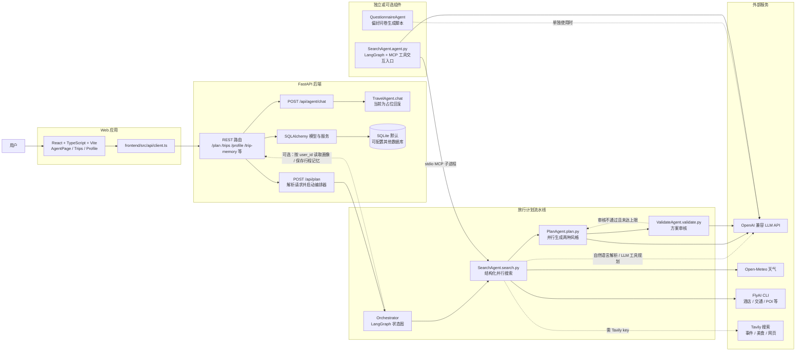
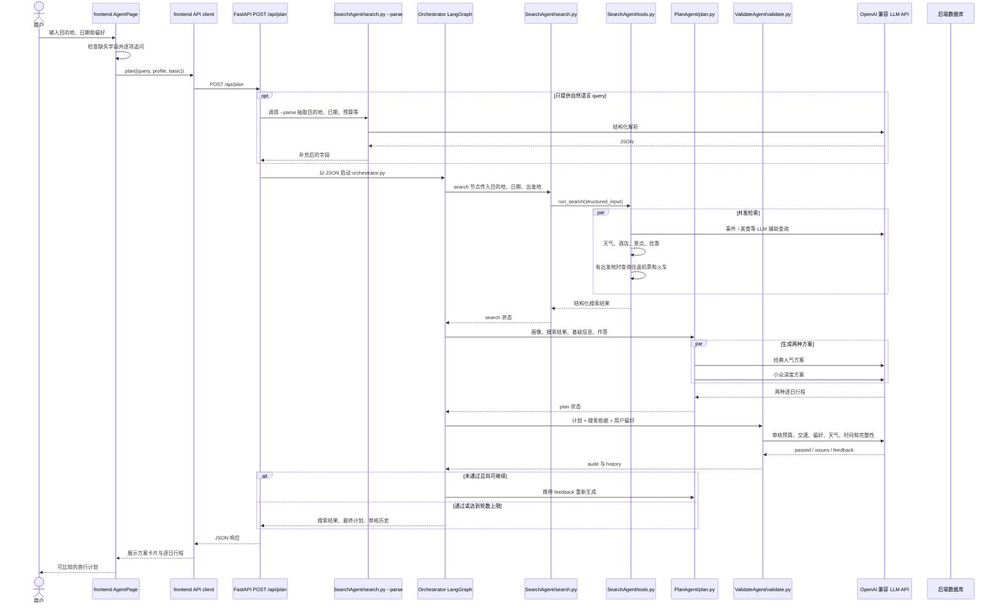
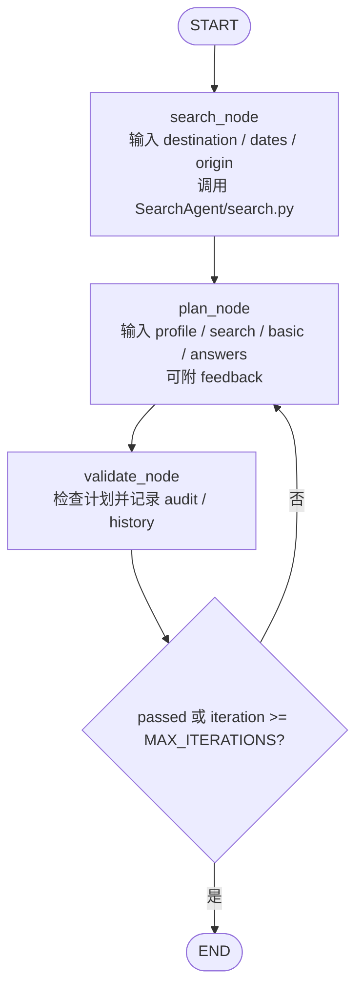
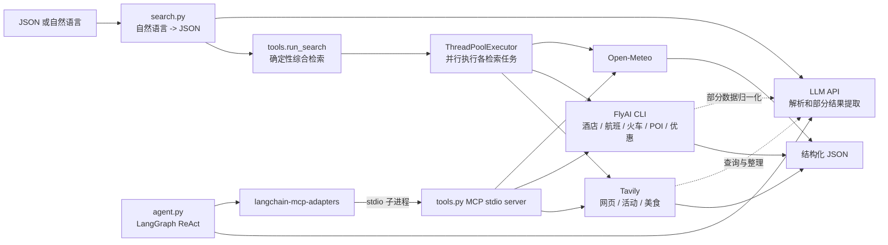
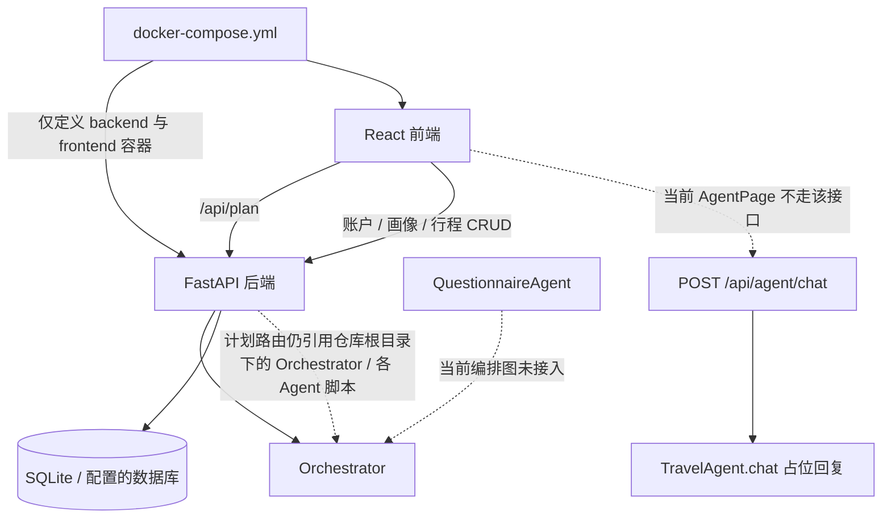

# Travel-Agent 架构图

本文按当前仓库代码绘制。项目同时包含 Web 应用、一个确定性的旅行生成流水线，以及一个单独的 MCP 搜索 Agent；这些部分并非都接在同一条运行路径上。

## 1. 系统总览

## 2. Web 端生成行程的实际调用顺序

Orchestrator 直接从命令行接收含 `user_id` 的 JSON 时，会通过 `BACKEND_URL` 读取画像并保存最终行程记忆；当前 `/api/plan` 的请求模型没有 `user_id` 字段，因此 Web 端这条调用路径不会触发这两个可选步骤。

## 3. Orchestrator 状态图和各节点数据

当前 `MAX_ITERATIONS = 1`，即首次生成后审核一次；若未通过，条件边也会结束。因此当前值下不会发生第二次携带 feedback 的重生成。`ValidateAgent/run.py` 有自己的独立循环实现，但 Orchestrator 调用的是 `validate.py`，两者不是同一个入口。

| 节点 | 输入 | 输出 / 副作用 |
| --- | --- | --- |
| `search` | `destination`、`start_date`、`end_date`、可选 `basic.origin` | `search` 结构化结果；并发查天气、酒店、景点、优惠、活动和美食，有出发地时再查往返机票与火车 |
| `plan` | `profile`、`search`、`basic`、`answers`、可选 `feedback` | 两个不同风格的行程方案和行程块；两个风格并发生成 |
| `validate` | `plan`、`profile`、`search`、`basic`、`answers` | `audit`、审核 `history` 和给计划生成器的 `feedback` |

## 4. SearchAgent 内部结构

`Orchestrator.search_node` 使用 `search.py` 的 JSON/CLI 入口，直接运行并行检索。`agent.py` 则提供可交互的 ReAct + MCP 工具调用入口；当前 Orchestrator 没有调用 `agent.py`。

## 5. 仓库中的其他组件与边界

- 前端 `AgentPage` 的生成按钮调用 `/api/plan`，不是 `/api/agent/chat`。聊天接口当前只返回占位文字。
- `QuestionnaireAgent` 已实现独立问卷生成，但当前 Orchestrator 图和 `/api/plan` 路由都没有调用它。
- `docker-compose.yml` 只定义 frontend 和 backend。Agent 脚本不是独立容器；后端计划路由以仓库根目录为基准查找 Orchestrator 和各 Agent，并要求对应 Python 环境存在。因此容器部署需要额外提供这些目录和解释器环境。
- Orchestrator 和后端计划路由写死了 `.venv/bin/python` 路径；这适用于类 Unix 环境，Windows 本地运行需要调整解释器路径或兼容逻辑。
- 可选的 user profile 与 trip memory 流程通过 `BACKEND_URL` 回调 FastAPI；普通计划请求不带 `user_id` 时不会读取或保存这部分数据。
