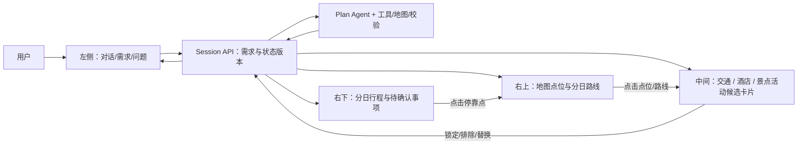

# Travel Agent 工作台接入方案（2026-09-30）

## 当前实施状态

- 已选择性并入三栏工作台、真实 Session API、景点与酒店卡片选择、右侧旧行程保留及更新提示；页面不再显示模型/地图调用次数或内部状态码。
- 已增加按日高德静态地图代理：使用现有 Web 服务密钥，由后端返回地图图片，密钥不传给浏览器。当前每张图最多 10 个标记、4 条真实路线；路线明细仍以行程卡片为准。前端交互式地图需要另行申请 Web JS API 密钥。
- 已补上同名 POI 和同一景区内部点位的跨日去重；旧草案不会自动改写，下一次计算才应用新规则。
- 仍需完成：真实交通供应商选择并锁定、页面刷新后的旧计划恢复、北京案例稳定通过路线与体验审计。供应商暂无可用数据时，不展示虚构班次或价格。

## 依据与边界

- 视觉和交互参考：`origin/feature/update-frontend`，提交 `3a9a9b2`。保留当前 `ykf` 的 P0/P1/P2 后端与会话 API，选择性移植界面组件；两分支从 `53d6ef2` 分叉，直接合并会回退现有规划代码。
- 参考分支现状：聊天回复、香港至首尔的机票/酒店/景点、价格和时间均写死在 `AgentPage.tsx`；加入计划只改本地 `planItemIds`；地图仍为占位。`client.ts` 有旧 `/plan` 和 `/agent/chat` 封装，但该页面没有调用它们。
- 当前 `ykf` 已有 `/api/sessions`、候选地点、锁定选择、相对日草案、路线、供应商候选、审计及重试。真实北京案例尚未稳定产出完整可验证行程；UI 改版不能被视为后端闭环完成。

## 目标界面与数据流

唯一可信状态是服务端会话及其 `state_version`。聊天、卡片、地图、行程通过 `place_id`、`stop_id`、`leg_id` 和日序号关联。卡片的“锁定”表示规划约束，不表示已经预订；地图上点击点位只改变焦点，明确点击锁定才提交选择。改动需求或选择后，旧行程显示为待重算，不继续展示为已验证。

## 模块与文件方向

| 模块 | 建议文件 | 要做的事 |
| --- | --- | --- |
| 工作台布局 | `frontend/src/pages/AgentPage.tsx`, `frontend/src/components/agent/Workbench.tsx` | 移植三栏视觉；宽屏候选区可并排显示交通、酒店、景点/活动三列，窄屏切换标签。保持左聊天、右上地图、右下行程。 |
| 会话状态 | `frontend/src/api/planning.ts`, `frontend/src/hooks/usePlanningSession.ts` | 保留当前有令牌的 Session API；封装创建、轮询、提问、编辑、运行、重试和版本冲突刷新。不要退回旧 `/plan`。 |
| 候选卡片 | `frontend/src/components/agent/OptionBoard.tsx`, `OptionCard.tsx` | `Place` 展示景点/酒店；`TravelOffer` 展示火车/飞机和供应商酒店。明确来源、查询日期、价格单位、未知值。锁定、排除和替换写回 Session。 |
| 地图 | `frontend/src/components/agent/TripMap.tsx`, `frontend/src/lib/mapAdapter.ts` | 国内先接前端地图 SDK；展示候选地点、已选酒店、每日编号点位与路线。坐标系按 `crs` 转换/校验；路线无 geometry 时标注“路径待查询”，不能用直线冒充实际路线。 |
| 行程 | `frontend/src/components/agent/DayTimeline.tsx` | 从 `current_plan.days` 渲染分日停靠点、相邻交通段、耗时及 `audit` 问题；与地图互相定位。 |
| 后端契约 | `backend/app/schemas/planning_api.py`, `backend/app/api/routes/sessions.py` | 对照前端补足候选分页/按类筛选、选择操作、供应商 offer 选择与关联地点；维持版本控制和幂等请求。只有真实缺口才加接口。 |
| 规划闭环 | `backend/app/planning/*`, `backend/app/runtime/*` | 修复真实案例中的未知路线、候选耗尽和审计失败；选择变化后局部重排、重新查询受影响路线、重新审计。 |

## 分阶段实施与验收

1. **P2 闭环基线**：固定上海→北京、5 天、2 人、偏人文古建、清淡饮食、交通便利这一案例；记录候选、状态迁移、各日地点与路线、真实失败原因。不得把 `partial` 或 `needs_attention` 显示为完成。
2. **数据契约**：区分 `Place`（地图地点）和 `TravelOffer`（供应商报价）；新增卡片视图适配层，不在 UI 中制造航班时刻、价格、开放时间。没有日期时机票/酒店报价显示“需确定日期”，仍可展示地点候选。
3. **三栏工作台**：选择性移植参考分支的布局、卡片、详情弹层和响应式样式；沿用现有 Session API。聊天消息触发需求更新，候选选择写回服务端，行程与地图基于同一版本刷新。
4. **地图联动**：先实现国内地点标记、每日分色、酒店和景点卡片联动，再显示有来源的真实路线 geometry 和耗时。地图 SDK 的浏览器 key 与现有服务端 Web Service key 分开管理；国外地图保留适配器入口。
5. **端到端验收**：运行北京 5 天实际案例；刷新页面后选择仍在；锁定/排除后路线重新计算；地图与行程点位一致；同一景点不跨日重复；所有缺失的路线、价格和时间明确显示未知；只有后端审计通过才显示“已验证”。

## 必须先确认的产品语义

- 中间区描述为“交通/酒店/景点三列”，参考代码目前是三个标签轮换。建议宽屏三列、窄屏标签；如用户更偏好始终标签，可只改呈现，不影响数据契约。
- “加入计划”要区分锁定候选、选择供应商报价和最终确认行程，不能用一个布尔值表达。尤其酒店候选地点与具体房型/报价可能不是同一个实体。
- 参考页面把不同项目价格直接相加并统一写作 `HKD`；实际需要保留币种、人数/房晚/单票计价范围与查询时间。无法换算或范围不明时不显示总价。
