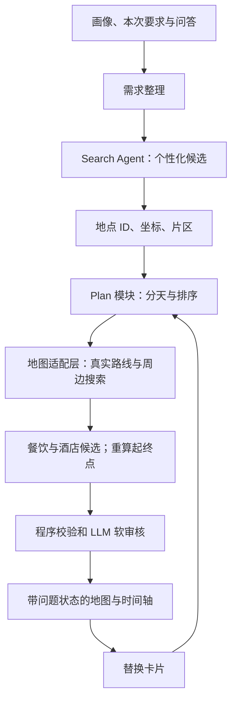
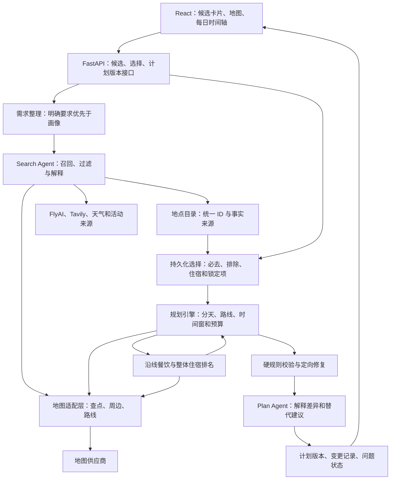
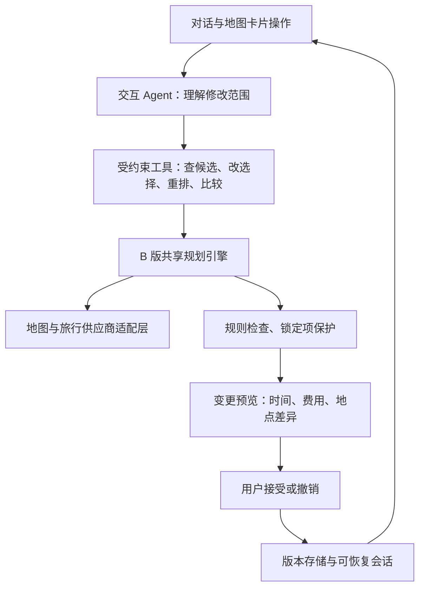

# Travel Agent 地图规划改造：三版方案与实施计划

日期：2026-09-29。状态：供选择的设计方案，尚未实施产品改造。

## 1. 推荐与范围

推荐 B「地图与卡片共同规划版」。A 适合先验证搜索和路线质量，C 适合 B 稳定后扩展对话编辑。三个版本共享数据契约和地图适配层，可以逐步演进；不需要同时开发三套系统。

第一期范围假设：国内单城市、2–7 天、一个旅行小组；可选择单酒店或用户明确指定的分段住宿；支持步行/公交/驾车路线查询、景点与餐饮推荐、住宿候选。保留城际交通查询，但不开发出票支付。排名权重由用户后续提供；先存储评分特征和解释，不把临时权重固化为产品规则。

“不走回头路”定义为减少不必要折返，并降低通勤与步行负担；不禁止回酒店、预约造成的绕行或用户明确选择的重访。不承诺数学上全局最优或未来交通耗时准确无误。

## 2. 三版比较

| 维度 | A 一键生成增强版 | B 地图共同规划版（推荐） | C 对话式持续规划版 |
|---|---|---|---|
| 主要入口 | 输入需求后自动出草案 | 看候选地图与卡片，选择后排程；也可自动推荐 | 在 B 中用对话或卡片持续修改 |
| 景点决定权 | AI 推荐，用户少量替换 | 用户必去/排除和 AI 推荐共同决定 | Agent 将对话转为受约束的编辑操作 |
| 地图作用 | 参与查点、分天、算路并展示结果 | 参与候选选择、住宿比较、路线与局部修改 | 再作为执行修改和解释影响的交互界面 |
| 规划方式 | 片区分组 + 简单排序 + 规则检查 | 时间窗、真实交通、锁定项、餐饮/住宿耦合 | B 的规划引擎 + 操作工具 + 持续会话 |
| 改造规模 | 后端核心中到大改；前端中改 | 数据/规划/工作区大改 | B 基础上再大改会话与任务编排 |
| 主要收益 | 尽快降低重复和明显折返 | 实现用户真正可选择、可调整的产品闭环 | 用自然语言完成精细修改 |
| 主要限制 | 可控性与复杂行程能力有限 | 需要明确交互流程和状态管理 | 调用链更长，修改意图歧义和成本更难控制 |
| 粗估总工作量 | 8–12 人日 | 18–30 人日 | 35–55 人日 |

估算仅用于相对选择：假设一名熟悉项目的全栈开发者、地图接口权限已可用、允许复用现有样式、包含基本联调与回归。不是交付承诺，不含第三方审批、正式报价采购、商业登录支付、跨城市和多人实时协作；完成地图接入试验后重新估算。C 的估算包含 B，而非额外工作量。

## 3. A：一键生成增强版

### 用户流程

输入旅行要求 → 系统生成个性化候选 → 地点标准化 → 按片区分天并查路线 → 补餐馆与酒店 → 校验 → 地图和时间轴展示。用户通过按钮替换景点或住宿，重算受影响的当天；暂不开发完整拖拽工作区。

### 逻辑架构图



地图提供的路线耗时必须反馈排程，不能先完成日程再仅画线。复杂冲突无法修复时输出待确认草案。此版不保证能妥善处理大量固定预约或复杂多酒店组合。

## 4. B：地图与卡片共同规划版（推荐）

### 用户流程

1. 需求确认：目的地、日期、预算、同行人数、行动限制、到达离开时间，以及本次兴趣。
2. 景点选择：地图和候选卡片同步显示。收藏不等于必去；支持必去、可选、排除、锁定日期/时段。用户可以接受默认建议，不强迫逐项点击。
3. 生成游览骨架：候选筛选、片区分天、初步路线；展示每日负担及不确定项。
4. 补充吃住：用餐时段沿线筛餐馆，整体路线评估住宿区域和酒店；用户选定酒店后重新计算每天起终点。
5. 确定版本：完整交通与时间校验后保存。后续替换景点、移动日期或换酒店均产生修改预览，可接受或撤销。

### 逻辑架构图



上图为逻辑模块图，各模块可放在同一个后端，不代表需要部署多个微服务。餐饮住宿与排程之间为有次数/耗时上限的局部迭代，不无限循环。

### 页面布局

| 左侧：候选与筛选 | 中间：地图 | 右侧：每日安排 |
|---|---|---|
| 景点/餐饮/住宿分类 | 按天着色的点位和路线 | 日期切换、访问顺序 |
| 偏好、价格、时长筛选 | 酒店/机场/车站独立图标 | 交通独立为路段卡片 |
| 推荐理由和事实来源 | 当前选中卡片高亮 | 时间、费用、待确认项 |
| 收藏/必去/排除 | 显示当前天，避免全图拥挤 | 替换、移动、锁定、撤销 |

选中地图点位时定位对应卡片；选择卡片时聚焦点位。地图平移只改变浏览范围，不自动修改旅行目的地或重排日程。提供“搜索此区域”避免每次移动都触发外部请求。窄屏使用地图/列表切换和底部详情卡。

## 5. C：对话式持续规划版

建立在 B 的基础上，用户可以说“第三天少走一点，酒店不变”“午餐换成素食，其他安排不动”。Agent 解析编辑意图并调用类型明确的工具，所有操作通过同一个规划服务，不能直接改数据库或自行编造路线。



新增内容：持久会话、编辑命令与参数校验、歧义澄清、调用预算、取消和重试、版本冲突保护、失败回滚。探索期间只生成待接受版本。排期被锁定项挤满时报告冲突，不偷偷删掉用户选择。

适合后续作为产品差异化，不建议在空间数据与基础排程尚不稳定时先做此版。

## 6. 哪些需要大改，哪些小改

“大改”表示输入输出契约或职责需要改变；“中改”表示保留主体并新增模块；“小改”表示局部行为和界面修正。新增核心模块虽无旧代码可重写，仍算大工作量。

| 当前位置/模块 | 规模 | 具体变化 |
|---|---|---|
| `SearchAgent/tools.py`、`search.py` | 大改搜索组织，中改供应商调用 | 接收需求、按兴趣/片区召回、去重补搜；保留供应商适配，保存地点 ID/坐标/原始来源而非只留标签。 |
| `PlanAgent/plan.py` | 大改 | 自由生成完整日程改为结构化候选与约束规划；模型承担推荐解释。移除名称前缀补链接；用地点 ID 关联。 |
| `backend/app/models/trip.py` 与 schemas | 大改 | 当前地点是文本、时间按天存，新增 Place、Selection、RouteLeg、Stay、PlanVersion 等对象；保留旧 Trip。 |
| `frontend/src/pages/AgentPage.tsx` | A 中改；B/C 大改 | 将组件内计划状态改为后端版本驱动；B 拆候选列表、地图、每日面板和修改预览。 |
| 地图适配层、路线/排程服务 | 大规模新增 | 地点查找、供应商 ID 映射、坐标系、实际耗时、路线缓存、约束检查。 |
| `Orchestrator/orchestrator.py` | A 中改；B/C 大改 | A 插入空间计算节点；B 加用户选择暂停/恢复、持久任务和局部重排，逐步替换一次性子进程串联。 |
| `backend/app/api/routes/plan.py`、前端 api/types | 中到大改 | 引入 trip/version/selection/job；分离候选检索和计划生成，返回明确错误及问题状态。 |
| `ValidateAgent/validate.py` | 首期小改；后续中改 | 取消无效输出默认通过；增加 unknown 与规则结果；后续定向补搜/修复，不全盘重复生成。 |
| 用户画像、旅行问卷页 | 小到中改 | 增加交通偏好、到达离开时间、步行容忍度和必要限制；不重复追问已有信息。 |
| 原有天气、城际交通、酒店供应商 | 保留并局部扩展 | 映射到统一结构，保留来源与失败状态；酒店查询补入住人数/房数等供应商支持的条件。 |

B 可先让旧 `/plan` 保持可用，新工作区使用新接口。旧行程不会自动拥有坐标；标记为待匹配，确认实体后才进入空间规划，禁止静默匹配到同名地点。

## 7. 深度结合地图的五个层次

### 7.1 地点身份

内部 place_id 关联多个 provider_id，名称仅展示。坐标携带坐标系。分店用地址/坐标区分；景区 parent_id 与片区 area_id 分开。片区是规划分组，可人工调整，不能把一个片区内的所有景点去重成一个。

已验证事实与模型推断分开存储。大景区使用入口/出口点而非只用中心点；第一版没有入口数据时标注路线精度限制。开放时间、票价和活动时间不能通过有坐标这一事实推断出来。

### 7.2 搜索与候选覆盖

需求分 hard_constraints、soft_preferences、unknowns。优先级：本次明确要求 > 本次已确认问答 > 长期画像 > 默认值；存在本次硬条件冲突时澄清，不能随意覆盖。

景点按类型和片区多路召回，控制总候选量。先筛硬条件再排序，未知条件标为待确认，不误认为满足。保留一部分多样性候选，防止画像把结果收窄为同类景点。候选不足时根据缺失片区/类型定向补搜，并限制轮次和调用预算。

### 7.3 路线与时间

两点路线与访问顺序是不同任务：地图供应商回答 A 到 B 怎样走，规划引擎决定今天去哪些点、以什么顺序去。

先按片区和几何距离筛掉明显不合理组合，再按需查询真实路线；不对所有候选、全部交通方式无差别两两请求。保留方向差异，不假设 A→B 和 B→A 相同。公交与驾车带出发时段；按供应商支持范围查询，不能把当前查询结果称为未来某时刻的精确预报。

路线缓存包含起终点/坐标版本、交通方式、时段、供应商与查询参数，按数据有效性设置过期策略。直线距离只用于粗筛；失败时不画成已核实的真实路线，不让模型补造耗时。

每天的可用时间从到达/离开和用户节奏确定。游览时长、交通、排队/换乘缓冲、餐饮和休息一并计入。普通日从酒店出发返回酒店，首末日使用实际机场/车站或用户设置的起终点。

### 7.4 餐饮与住宿

餐饮先按饭点附近片区或路线附近找候选，再计算插入该餐馆带来的额外耗时。直线最近未必最顺路。过滤口味/忌口、预算和营业时段；营业未知不能标为保证可用。

酒店先推荐住宿区域，再比较候选酒店对多天首末段交通的影响；默认避免无理由频繁换酒店。已订酒店先锁定。未定酒店以片区锚点形成初稿，选择酒店后回算全部相关路线。第一版允许有限候选间迭代，不追求穷举所有酒店/景点组合。

预留 ranking 策略：输入候选与偏好、距离/绕行时间、价格口径、评分/评价数、证据状态；输出分项特征、适配度、解释及规则版本。用户公式到位后接入。距离降低可以提高“距离得分”，但总排名仍要遵守预算、可用性等硬条件。缺失评分不伪造；不同平台评分不直接混比。

### 7.5 地图交互与重算

| 操作 | 重算范围 |
|---|---|
| 打开卡片、移动地图视野 | 不重算计划 |
| 改备注 | 不查路线、不重排 |
| 替换餐馆或单景点 | 相邻路段和当日时序；必要时扩展至当日，保留锁定项 |
| 把景点移动到另一日 | 原日与目标日、各自相邻路线及时间检查 |
| 改酒店/日期/交通方式 | 相关日期起终点、受影响路段和开放/预约条件；不是仅刷新线条 |

修改以 parent_version 为基线。长任务结束前核对版本，过期结果不能覆盖更新的选择；前端预览差异并可撤销。保存服务端结构化状态，刷新恢复。

## 8. B 版建议接口和核心数据

以下是拟新增接口，不代表现有实现。

| 接口 | 用途 |
|---|---|
| `POST /api/trips/{id}/candidates/search` | 依据结构化需求检索候选，返回各来源状态 |
| `PUT /api/trips/{id}/selections` | 保存候选选择和锁定条件，带基线版本 |
| `POST /api/trips/{id}/plans` | 创建规划任务，返回 job_id |
| `GET /api/planning-jobs/{id}` | 状态/进度；首版轮询，后续可增加 SSE |
| `POST /api/trips/{id}/plans/{version}/edits` | 生成局部修改预览版本 |
| `GET /api/trips/{id}/plans/{version}` | 地图、卡片、时间轴共享输出 |
| `POST /api/trips/{id}/plans/{version}/accept` | 接受预览，切换当前版本 |

地图供应商适配接口建议为 search_places、get_place、search_nearby、get_route；路线矩阵由自身组合与缓存，不假定供应商有适用所有模式的批量矩阵 API。

```text
TripIntent: 用户本次约束、偏好、未知项、来源与优先级
Place: ID、供应商映射、坐标/坐标系、入口、类型、片区
PlaceFacts: 开放/费用/建议时长、来源、采集时间、事实或推断
Selection: 必去、可选、排除、日期/时段锁定
Stay: 酒店 ID、入住退房、人数/房数、报价与可用性来源
Visit: 地点 ID、日期、开始/结束、时长、锁定状态
RouteLeg: 起终点、方式、耗时/距离/换乘、几何线路、来源
PlanVersion: 版本、父版本、Visits、RouteLegs、Stays、费用账本
Validation: passed/failed/unknown、问题、修复情况、待确认项
```

预算同时显示已知金额和未知部分，脱敏酒店价不能参与精确总价计算。照片、平台评分和开放时间按接口实际返回，不保证每项都有。

## 9. 优先级和实施里程碑

### P0：不可跳过的数据与质量基础

| 里程碑 | 工作 | 验收门槛 |
|---|---|---|
| M0 接口试验 | 地图 Key/权限检查；上海 POI、步行/公交/驾车各一条；记录字段与缺失值 | 确认数据、坐标和接口配额可用；错误可解释，不把接入当自动成功 |
| M1 需求和实体 | 搜索接画像/本次要求；地点 ID 与坐标；去重；新数据模型和迁移 | 同名不同店不合并；同景点别名可识别；明确排除项不进入最终选择 |
| M2 玩与行闭环 | 片区分天、真实路线、时间安排、基础规则；地图只读结果；保存版本 | 上海五日无无理由重复；交通有来源；首末日边界正确；刷新可恢复 |

同时做小修：取消审核异常默认通过、前端展示审核和源数据状态、停止危险前缀补链接。它们不是完整验证 Agent 重构，但能避免把未核实草案表现为可靠方案。

### P1：B 版产品体验，仍属于本次目标

| 里程碑 | 工作 | 验收门槛 |
|---|---|---|
| M3 地图工作区 | 候选/地图/时间轴联动、选择锁定、局部编辑、变更预览 | 用户选项影响实际排程；未锁定项目才允许系统调整；旧请求不覆盖新版本 |
| M4 吃住与完整回归 | 饭点沿线餐饮、酒店多日比较、排名插槽、两方案指标比较 | 换餐馆更新相邻路线；换酒店更新相关天；未知价格可见；回归案例通过 |

B 版只有完成 M4 才算达成当前完整目标。M2 可先演示，但不能称地图卡片产品已经完成。

### P2：后续扩展

对话编辑工具（C）、多城市/分段住宿优化、更完善的验证补搜、自适应拥挤度、天气变化重规划。上线公网前另需真实认证、资源所有权检查、调用限额；现有开发验证码与 user_id 传参不能作为生产认证。

## 10. 验收测试与成功指标

固定回归数据用于验证算法和规则；真实地图查询验证供应商契约；浏览器测试验证交互。测试结论分开报告，不能用 HTTP 成功代替行程正确。

1. 上海五日：城隍庙/豫园片区优先同日；无理由重复景点为零，允许明确重访；酒店锚点不算重复游览。
2. 需求约束：必去/排除、素食/行动限制、已订酒店和预约时段均保留；不可能满足时输出具体冲突。
3. 路线质量：比较优化前后交通时间、步行和换乘；不能因减少路程破坏开放时间。没有可比真实路线时不声称节省百分比。
4. 数据故障：地图无路线、部分供应商失败、未知票价、过期报价、活动无场次，均显示对应状态而不是补造。
5. 编辑恢复：替换/跨天移动/换酒店后数据一致；刷新恢复；撤销可用；取消与过期任务不覆盖新计划。

两方案比较采用可解释维度：必去覆盖、非锁定景点差异、通勤/步行、已知费用和未知项。允许同一必去景点出现在两套替代方案里，不把跨方案重合误判为同一次旅行重复。

## 11. 复用建议与外部依赖

- TREK：参考地图/卡片/每日时间轴和酒店锚点交互。其 AGPL 许可需要在直接移植前确认适用要求；不整包替换当前系统。
- TRIP：参考地点、行程项和预订分层；FastAPI 后端接近本项目，MIT；Angular 前端不能直接当 React 组件使用。
- ITINERA：参考候选筛选与空间聚类；示例上海数据用于研究，不能视作当前营业事实；真实交通仍由地图数据补齐。
- OR-Tools：需要更复杂时间窗时接入；不是地图或事实源，仍需自己提供约束与路线耗时。

地图首选评估高德国内能力，但通过适配层隔离供应商。需要前端 JS API 配置和后端 Web 服务权限；按官方要求配置安全代理/域名等，服务端密钥不进入前端包。账号配额与数据使用条件需要按实际接口确认，不假定免费无限调用。

来源：

- [高德路径规划](https://lbs.amap.com/api/webservice/guide/api/newroute)
- [高德 POI 搜索](https://lbs.amap.com/api/webservice/guide/api/newpoisearch)
- [高德 JS API 安全配置](https://lbs.amap.com/api/javascript-api-v2/guide/abc/jscode)
- [OR-Tools 时间窗路线规划](https://developers.google.com/optimization/routing/vrptw)
- [TREK](https://github.com/liketrek/TREK)
- [TRIP](https://github.com/itskovacs/trip)
- [ITINERA](https://github.com/YihongT/ITINERA)

本计划基于现有工作区结构和此前页面复盘。没有执行产品改造或新接口测试。选择 B 后建议按 M0→M1→M2→M3→M4 推进，每个可审查的改动独立提交；现有未提交改动保持原样。
