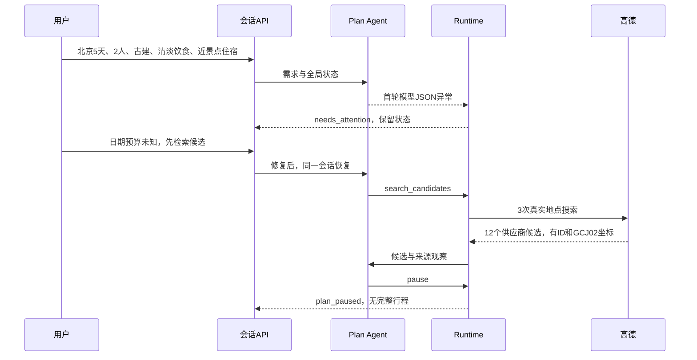

# P1 实施与真实任务验收报告

更新：2026-09-29。结论：国内 P0 按约定范围已完成；P1 最小编排、持久状态和真实查点循环可验收。完整五日旅行任务仍未完成，路线、餐饮与住宿联合规划属于 P2。

## 现在已实现

1. Plan 根据需求、画像快照、答案、选择、观察和限额选择下一动作；开放 ask_user、search_candidates、get_place_details、pause。
2. QAgent 按具体字段缺口提问；答案绑定 question_id/state_version；结构化表单可直接更新，自由文本通过模型解释后校验来源与更新范围。
3. 国内高德搜索和详情接入；偏好影响 Plan 的检索任务。供应商 ID 对应内部 ID，但候选身份不等于实体归并完成。
4. SQL 原子版本检查、请求幂等、随机会话令牌哈希、调用上限、30 秒租约/5 秒心跳、超时、取消和显式恢复已实现。
5. 自有需求、画像、答案、选择、内部候选引用和执行元信息落库；供应商对象与模型摘要只在内存，重启后重新检索。旧旅行表未被重写。

当前新 API 与旧前端入口并存。完整 Validate、路线引擎、附近吃住排序及 finish 门槛的完整校验在 P2；P1 直接禁用 finish，不允许伪造已完成计划。地图卡片在 P3。

## 验证证据

| 验证 | 结果 | 能证明什么 |
|---|---|---|
| 全部后端测试 | **94 passed**，临时数据库隔离；原 P0/旧接口 49 项、新 P1 45 项 | 契约、控制流、SQL 版本、所有权、恢复、预算、取消、错误分支通过 |
| compileall 与 git diff --check | 通过 | Python 可编译、差异格式通过 |
| 上海真实有界样例 | 问人数→答案解释为 2 人→高德候选→Plan pause；5 次模型、2 次高德、8 个有坐标和来源的候选 | 真实 Plan/Q/高德可以接通；不是开放旅行质量基准 |
| 实际后端进程重启 | HTTP 创建与编辑后，重启仍读到版本 1、需求备注和画像；随后取消成功 | 持久状态可跨进程恢复；本检查 0 外部调用 |
| 真实北京任务 | 同一会话失败后修复并恢复；成功阶段 2 次模型、3 次高德，12 个候选，随后 pause | 新真实输入能完成需求→候选→暂停；没有生成路线或假酒店报价 |
| 北京实际数据库检查 | candidates=[]、agent_message=null、内部候选引用 12 个、状态版本 6 | 最终运行没有把供应商对象或摘要写入数据库 |

测试命令：设置 PYTHONPATH=backend 及新的临时 DATABASE_URL 后，`.venv/Scripts/python.exe -m pytest backend/tests -q`。最后一轮为 94 项，9.37 秒。前端本次未修改，未重复运行前端构建。

## 上海探测的失败记录

- 首次 Plan 返回了非法问题缺口名，被白名单阻止；0 高德调用。补强字段枚举与明确的机器字段示例。
- 第二次完成问答与候选，继续扩大检索后到达试验地图预算；正确暂停，但不能算正常主动 pause 验收。
- 一次问题格式失败被保留为诊断；补强 Q 的模式枚举，增加每次运行最多一次的格式修复机会。
- 最终有界任务主动 pause，通过该样例；供应商摘要后来拆为易失 agent_message，固定 attention_reason 才落库。最终存储策略由离线测试及北京实际数据库检查补充验证。

记录保存在 smoke-shanghai-initial.json、smoke-shanghai-budget.json、smoke-shanghai-contract.json、smoke-shanghai.json。失败记录未删除，也不标记为成功。

## 上海→北京真实任务

输入：上海出发，北京 5 天，2 人，舒适、人文、古代建筑；饮食清淡健康、不喜欢吃辣；住宿靠近景点、交通便利。用户随后明确日期与预算暂不确定，先测试候选检索。

需求录入结果：origin=上海、destination=北京、duration_days=5、party.count=2；兴趣、舒适标签和饮食/住宿要求保存为带来源的偏好与条件。没有虚构日期、总预算、交通方式、开门时间、餐馆菜单或酒店库存。

本次脚本按用户明确给出的信息构建 TripIntent，和原始文本一起提交新 API；这不是“只输入自由文本、系统自动完整抽取需求”的验收。新接口目前接收结构化需求；旧前端尚未切换，不能把这个测试说成产品页面端到端已完成。

真实顺序：

本轮全部为景点候选，餐饮 0、酒店 0。成功阶段 2 次模型/3 次高德；包含首次失败和一次诊断后，会话累计 4 次模型尝试、3 次高德、3 次 Plan 步骤。诊断调用记入原预算，没有另建会话清零。

首轮发生 model_invalid_json，未记录原响应，因此无法确定它究竟是截断、空内容还是其他格式问题。一次受控复现返回 finish_reason=stop、526 字符正式内容、5082 字符推理内容、1496 completion tokens，未复现该错误。原配置没有显式控制思考模式且 max_tokens=2200，存在短动作被推理预算挤占的风险。

修改：DeepSeek 短动作输出明确设置 thinking=disabled；上限改为可配置的 4096；检查 finish_reason=length 与空内容；JSON/Schema 错误允许一次有预算的修复。其他兼容供应商不发送 DeepSeek 参数。默认思考模式及截断语义依据 [DeepSeek 官方接口文档](https://api-docs.deepseek.com/api/create-chat-completion/) 与 [Thinking Mode](https://api-docs.deepseek.com/guides/thinking_mode/)。这解释了改动理由，但不把未复现的首轮原因写成已经确定。

本次尚未解决：

- 景区本体与内部建筑同时被召回，有父子地点重复安排风险。
- 市区与远郊候选混合，需要真实交通耗时与舒适约束筛选。
- 清淡饮食、附近住宿已录入，但尚未成为餐馆/酒店的检索与排名结果。
- 未生成五日日程，未检查预约、开放时间、停留时间、酒店锚点与返程边界。
- 北京 POI 查询已验证；北京公交参数及上海→北京城际交通尚未验证。P0 的公交实测与适配限制目前是上海。

因此：**P0 和 P1 的阶段范围通过；完整旅行任务不通过交付验收，等待 P2。** 一次复测通过不能代替后续多轮真实稳定性评测。

## 接口与操作

后端：`http://127.0.0.1:8000`；交互接口文档：`http://127.0.0.1:8000/docs`。

| 方法 | 路径 | 用途 |
|---|---|---|
| POST | /api/sessions | 提交 typed intent、profile snapshot、message；一次返回 access_token |
| GET / PATCH | /api/sessions/{id} | 读状态或编辑需求/选择 |
| POST | /api/sessions/{id}/run | 显式运行或恢复，带 request_id/base_state_version |
| POST | /api/sessions/{id}/answers | 提交关联问题的答案，接受后显式 run |
| POST | /api/sessions/{id}/cancel | 取消；在途旧结果不能落库 |
| GET | /api/sessions/{id}/events | 读取有界事件，after 游标 |

除创建外，均需 Authorization: Bearer access_token。相同 request_id 与相同请求重放不会重复执行；同一 ID 换内容会拒绝。回答或编辑后重新读取版本再运行。

真实脚本均需显式 `--live`，不能作为普通离线测试自动执行。execute_beijing_case.py 的 `--remember` 将测试访问能力保存在被 Git 忽略的 backend/.env，报告不含令牌；`--resume-last` 保持同一会话继续执行。恢复不自动扩大预算。当前本地后端采用单进程内存地图上下文。

## 提交、跟进和下一步

- 3477f5d：根据 P0 修订 P1 计划与架构图。
- b1111dd：持久 Plan 主导循环、Q、地图工具、新 API 与测试。
- 88cf247：北京真实任务暴露的 JSON 容错与配置修复、执行脚本。
- 后续报告提交：见本文件 Git 历史。

均在本地 ykf。推送实测仍为 HTTP 403：当前 GitHub 身份 icn1Vad 无 ylll2002/Travel-Agent 写权限。已有六处无关模型配置修改未混入提交。

下一步 P2.1：定义地点父子关系、同片区约束与候选覆盖标准，使用本次北京候选作为回归案例；随后补北京真实交通适配与按天路线引擎。日期仍未知时可做候选和片区草案，不能承诺精确预约/交通/房价。
