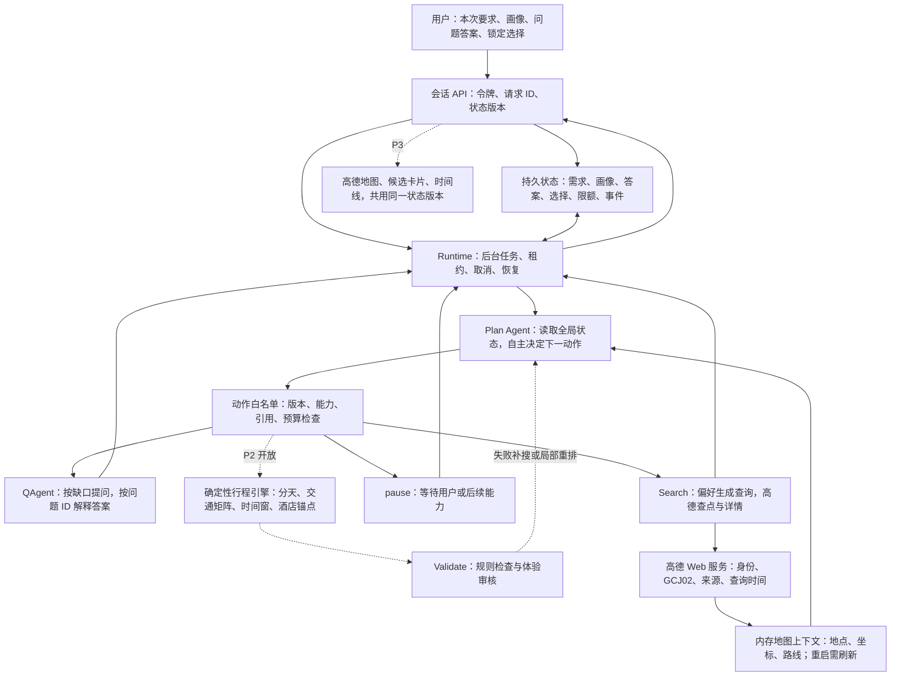

# P1：Plan 主导的可恢复编排

更新：2026-09-29。P0 国内验收完成；本阶段实施范围为后端编排。海外已由用户明确暂缓。

执行状态：P1 国内最小编排已实现，94 项后端测试通过；上海有界样例与上海→北京真实候选任务均已执行。完整结果、首次失败与修复记录见 execution-report.md。本图虚线仍为未来能力，不代表完整行程或前端地图已上线。

## 依据 P0 调整

1. 上海查点、详情、周边及三种交通已有证据；这不代表五日行程已经可用。P1 接入查点与详情，时间矩阵和路线求解仍为 P2。
2. 地点目前为供应商候选身份，不能用同名合并；搜索结果按内部 ID 去重，不承诺跨供应商实体归并。
3. 供应商地点内容、坐标、几何及可能复述它们的模型摘要只存在进程内存。数据库只保存自有需求、画像快照、答案、选择、内部候选引用及执行元信息。重启后显式标记需要重新检索。
4. `no_route`、未应用出发时刻等结果继续保留；P2 验证不能把缺失交通默认为通过。
5. 加入 `pause` 动作：P1 还没有路线求解器，Plan 应明确暂停并说明下一阶段能力，而不能伪造完整计划或反复调用未开放工具。

## 架构参考图



Plan 决定调用谁；Runtime 只执行有效动作和生命周期规则。采用显式异步循环，每一步落库，不新增一套固定 Search→Plan→Validate 顺序。后续可以将相同节点接入 LangGraph，但不依赖进程内 MemorySaver 实现恢复。

## 文件组织与修改量

```text
backend/app/
├── agents/                 新建：统一结构化模型调用与职责提示词
│   ├── client.py           兼容 Chat Completions；JSON、超时、脱敏错误
│   ├── plan_agent.py       全局状态→白名单动作；当前请求优先画像
│   └── question_agent.py   缺口→问题；答案→可校验需求补丁
├── runtime/                新建：本次主要改动
│   ├── store.py            SQL 原子版本比较、租约、幂等、配额、事件
│   ├── executor.py         Plan 循环；暂停/恢复/取消；过期结果丢弃
│   └── guards.py           地区、引用、完成条件与可用能力
├── tools/registry.py       新建：Q/高德工具；P2 工具明确未开放
├── services/intent_service.py 新建：画像与当前需求合并、答案来源
├── models/planning.py      新建：会话、命令、事件、迁移版本表
├── schemas/planning_api.py 新建：正式请求响应契约
├── api/routes/sessions.py  新建：创建/读状态/运行/回答/编辑/取消/事件
├── migrations/planning.py 新建：可重复执行的增量建表
├── schemas/session.py     小改：候选引用、刷新标志、恢复提示
├── schemas/action.py      小改：pause 动作
├── config.py              小改：模型配置与运行上限
└── main.py                小改：注册接口和关闭后台任务
backend/tests/test_p1_runtime.py  新建：真实控制流、替身外部服务
backend/scripts/smoke_p1.py       新建：显式有界真实模型+高德冒烟
```

旧 `/api/plan` 与前端本次保留兼容。P1 新入口 `/api/sessions` 可在 `/docs` 使用；P2 打通行程后再切换产品入口，P3 接地图工作区。

## 执行顺序与验收

| 优先级 | 有界任务 | 验收 |
|---|---|---|
| 1 | 修订契约、增量建表、持久状态和会话所有权 | 不改旧旅行表；令牌哈希；重放幂等；过期版本拒绝 |
| 2 | Plan/Q/查询工具、Runtime 生命周期 | Plan 自主选动作；问题暂停不占任务；答复关联问题；取消后丢弃结果 |
| 3 | 接口、自动测试、有界真实冒烟 | 重启恢复；预算耗尽停下；伪造 finish 被拒；真实候选有来源 |
| 4 | 记录结果、提交、桌面同步 | 区分离线验证与真实调用；记录调用数与当前范围 |

恢复指显式调用 run 继续未完成任务，不在启动时自动重放可能收费的网络调用。进程异常退出后的在途任务等租约过期才能抢占；已消耗预算不因恢复清零。

当前租约 30 秒、每 5 秒续约；请求过期后重新抢占，旧任务的写入还需通过租约和版本检查。短动作默认非思考模式，输出 token 上限 4096；每次运行最多一次 JSON/Schema 修复，消耗原预算。未来复杂规划的模型模式需 P2 评测，不能以模式开关替代路线计算。

新会话使用一次性返回的随机访问令牌，数据库保存哈希；不能沿用现有开发登录里的裸 `user_id` 作为安全边界。这是会话隔离，不代表旧登录系统已经升级为正式认证。

问答提取只更新该问题允许的字段，保留原答案和来源。歧义继续提问，不能默默补齐人数、币种或日期。当前消息/结构化表单优先长期画像；画像为新会话的快照，不会在后台悄悄变化。

P1 完成不等于旅行质量完成：偏好查询具备最小接入，完整排序、跨天去重、回头路优化、酒店与路线联合求解仍须 P2 验收；地图卡片和选择交互须 P3。
