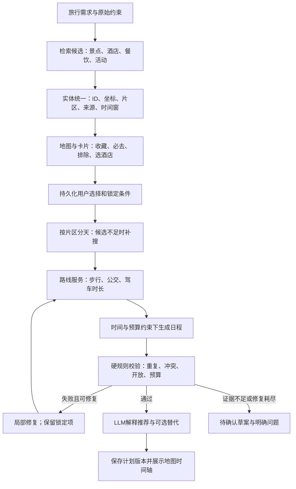

# 上海五日方案复盘与地图规划架构建议

审查日期：2026-09-28。状态：设计建议，尚未实施产品改造。

依据：当前浏览器 `/agent` 中 2026-09-29 至 2026-10-03 的「经典人气」「小众深度」两份方案、当前工作区代码，以及文末官方资料。未重新生成或刷新这两份方案。当前页面未展示原始搜索响应与审核结果，因此不能反推这次请求的全部 API 成败或审核意见。

## 1. 结论

真实搜索与模型调用已经接通，但“返回了 JSON”和“行程可执行”之间缺少约束系统。主要缺失是：可定位的地点实体、景点去重与片区安排、真实路线耗时、开放时间/活动场次核验、预算账本，以及有效的审核与修复闭环。

建议保留 React、FastAPI、LangGraph 和现有供应商适配器，重构规划数据与决策流程。增加更多 Agent、改模型或仅追加提示词都不能保证这些硬约束成立。

## 2. 两份方案的具体证据

| 方案 | 页面事实 | 判断及处理方式 |
|---|---|---|
| 小众深度 | D1 城隍庙、南翔馒头店、豫园、绿波廊；D3 晚餐上海老饭店（城隍庙店）；D5 宁波汤团店（豫园店）、城隍庙、南翔馒头店 | 城隍庙/豫园片区出现在三个不同日期。不是三整天都在同一个景点，但城隍庙、南翔馒头店确实重复；无用户指定重访理由。 |
| 小众深度 | D3 外滩，D5 外滩“补拍阴天江景” | 模型自行用“补拍”解释重复。摄影用户可接受重访，但应显式选择或作为可选项，不应默认挤占五日方案。 |
| 经典人气 | D1 豫园、城隍庙小吃广场；D2 城隍庙、同一小吃广场；D1 和 D3 均有南京路步行街 | 同片区拆天和重复用餐；可优先合并老城厢景点。外滩白天和夜景不必一概禁止，但需说明体验差异。 |
| 经典人气 | “外滩本帮菜馆”的链接与“外滩”完全相同；“新天地餐厅”“武康路咖啡馆”等泛称被安排为餐馆 | 链接错配已确认。泛称不是可以导航/预约的具体商户，不能判定为已验证地点。 |
| 小众深度 | D2 09:30–12:00“中国上海国际艺术节”；14:30–17:00“上海交响乐团2026-27音乐季” | 节庆/音乐季是集合，不是具体场次。缺少场馆、场次、开始时间、票务状态；不能把搜索标题直接排入时间表。 |
| 小众深度 | “黄浦江游览”链接搭配“乘轮渡2元” | 产品名与交通描述有混淆风险；尚未核实链接对应产品，不能把轮渡票价当游船报价。 |
| 两份 | 每天都有酒店，包括写了返程的最后一天；小众方案价格是“¥1xx起” | 住宿推荐与实际住宿夜数混在一起。应按入住/退房和实际返程时间计算，脱敏起价不能用于精确预算。 |

艺术节官网介绍的主节期为 2026-10-17 至 11-15，晚于本次行程；但官网节目列表也有 9 月 30 日、10 月 2 日演出，因此不能断言行程期间没有相关活动。可靠结论是：当前安排没有绑定具体节目，日期和时段没有得到证明。见文末官方链接。

## 3. 真实接入、占位与缺失

| 功能 | 当前状态 | 边界 |
|---|---|---|
| 天气 | Open-Meteo 真实请求 | 接通不等于任意未来日期都有可靠预报；缺失/过期需展示。 |
| 酒店、景点、促销 | FlyAI CLI 真实请求 | 当前只保留少量文本字段；试用结果价格可能脱敏，未实现房型库存与下单。 |
| 城际机票/火车 | 已有 FlyAI 真实查询，只有有 origin 时才触发 | 不能据此认定页面已选定有效班次。当前两份页面没有明确去返程班次。 |
| 市内步行、地铁、驾车路线 | 未接路线 API；PlanAgent 生成备注 | “地铁10号线”“步行5分”不是计算出的两点间路线。 |
| 活动/餐饮搜索 | Tavily 真实检索 + LLM 特征提炼 | 网页标题与摘要不等于可定位商户、营业时间、具体活动场次或可订库存。 |
| 双方案 | 两次并行 LLM 调用，输入同一候选池、不同风格词 | 不是固定 mock，但缺少可量化的差异和可执行性保证。 |
| 地图、POI选择、酒店比较、锁定/排除、局部重排 | 未实现 | 现有卡片仅用于展开完整方案。 |
| 审核 | 真实 LLM 审核，但闭环不完整 | 一轮即结束；不通过不阻断展示；无有效布尔结果时默认通过。 |
| QuestionnaireAgent | 独立模块可调用，主流程未接入 | 前端使用固定缺字段问题，不是该 Agent。 |
| 行程/画像 CRUD | 真实数据库接口 | 不等于 AI 生成的完整计划已持久化；AgentPage 的 plans 是组件状态。 |
| 长期记忆 | 存储接口及 CLI 保存分支存在 | Web PlanRequest 不传 user_id；未形成用户选择→记忆→下次规划闭环。 |
| 旧 `/agent/chat` | 明确占位回复 | 当前页面调用 `/plan`，不能把当前双方案误判为旧 chat mock。 |
| 短信登录、目的地目录 | 开发验证码、样例目的地种子数据 | 验证码直接返回；不是生产短信认证。目录数据库可读写但初始内容是样例。 |
| 预订支付 | 未实现 | 外跳链接不等于订单、库存锁定或支付能力。 |

## 4. 代码层根因与优先级

### P0：实体与审核必须先修

1. **地点没有身份和空间约束。** `SearchAgent/tools.py:_fetch_poi/_fetch_hotels` 的标准输出不保留稳定供应商 ID、经纬度和坐标系。`PlanAgent/plan.py:_trim_search` 再精简为名称/类别/简述。无法可靠区分别名、同名地点、不同分店及景区包含关系。
2. **提示词承担了本应由程序完成的约束。** PlanAgent 要求“地理就近”“总花费不超预算”，但没有交通矩阵、时间窗、逐项费用、人数/间夜核算。JSON 模式只保证可解析，`_build_one_plan` 仅粗查 itinerary 非空。
3. **审核无法提供通行保证。** `ValidateAgent/validate.py:77` 对无有效结果默认通过；`Orchestrator/orchestrator.py:46` 的 `MAX_ITERATIONS=1` 是现有性能取舍，导致反馈循环实际没有下一轮。应改为 `passed / failed / unknown`，unknown 不得标为通过。
4. **前端隐藏失败。** `AgentPage.generate` 只取 plan/plans/blocks，不处理 passed/history 或源数据缺失。后端错误常用 HTTP 200 返回，client 又只检查 HTTP 状态，可能显示“生成0个方案”而非真实错误。
5. **链接按字符串前缀回填。** `_backfill_links.find_url` 允许“外滩”匹配“外滩本帮菜馆”。修复方向是实体 ID 引用，匹配不确定时留空并标待确认，禁止用前缀强行补齐。

### P1：搜索、偏好与状态

- 搜索按城市执行一次固定工具集合，不按天数、兴趣、片区覆盖扩展候选，也不检查候选池是否足够。原始信息被 LLM 标签替换，日期/价格来源难以追溯。
- 两方案共享候选池，但只是 style 不同，没有景点集合差异、交通总时长、预算或步行负担的比较目标。应允许共同包含用户必去项，比较其余选择与节奏。
- Web 主路径是 `search.py -> tools.run_search` 的固定工具调用，不是 `SearchAgent/agent.py` 的 ReAct/MCP 自主调用链。模块名称多，不代表自动补搜能力已经存在。
- 原始自然语言经解析后主要变成目的地、日期、origin/人数/预算/目的等字段；未经建模的否定、行动限制、已买票时段等细节可能丢失。应存储原始要求及结构化约束，关键歧义才追问。
- `modify` 只在 PlanAgent 局部接口和提示词出现；网页请求和 Orchestrator 没有传递旧版本/锁定项/修改命令。当前对话不能保证“只换第三天下午”。
- PlanRequest 没有 trip_id/plan_version/user_id；组件内存加子进程内 MemorySaver 不是持久会话。刷新后没有可靠恢复与修改基线。
- 供应商调用需要超时、并发限制、退避、缓存和 source_status；部分失败时应允许展示可用候选，但必须显式降低结果状态。

## 5. 建议目标流程

以下是逻辑模块图，不要求每个模块成为独立服务；第一版保持模块化单体即可。

分工：LLM 解释需求、推荐候选和组织自然语言；程序管理地点身份、计算路程、检查时序与费用、执行锁定条件。LLM 软审核补充舒适度/兴趣匹配，不能覆盖硬规则失败。

## 6. 数据契约

| 对象 | 必要字段 | 约束 |
|---|---|---|
| TripIntent | 日期/时区、origin、人数、预算币种与口径、到达离开时间、交通偏好、硬限制、原始要求 | 区分已确定与待询问；不能擅自假定整天可玩。 |
| Place | 内部 place_id、provider_ids、type、name、aliases、city、address、location、coordinate_system、area_id、parent_id | 同片区不等于同实体；城隍庙与豫园可以同日都去，别名应去重。 |
| PlaceFacts | 开放时间/适用日期、建议停留时长、价格区间、来源、fetched_at、verified_status | null 表示未知，不能变成 0 元或全天开放；模型建议与事实分开。 |
| EventSession | event_id、venue_place_id、start/end、booking_url、availability、source | 音乐季/艺术节属于集合，必须细化到场次才能作为固定时间活动。 |
| HotelOffer | hotel_place_id、入住退房、人数/房数、房型、间夜价/总价、币种、税费口径、退款条件、抓取时间 | 地图地点不是酒店报价；“¥1xx”标为未知精确金额，不能算成100元。 |
| Selection | trip_id、entity_id、must_visit/shortlist/exclude、locked_day、locked_time、hotel_choice | 收藏不等于必去；状态冲突时要求用户调整。 |
| RouteLeg | from/to ID、方式、出发时间、duration、distance、steps、polyline、source、fetched_at | 地图直线距离只可辅助初筛，不能冒充实际交通耗时。 |
| PlanVersion | version、parent_version、days/items、route_legs、cost_ledger、validation、change_log | 通过版本条件防止旧请求覆盖新选择；支持撤销。 |

酒店选址与日程应相互评估：先给不同住宿片区候选及交通代价，用户锁定酒店后重新计算每天起终点。不能只按星级或低价挑酒店。

## 7. 地图与卡片交互

桌面建议三栏：候选列表｜地图｜按日时间轴；窄屏使用列表/地图切换与底部详情卡。

1. 景点卡：名称、图源、类型、所在片区、建议游玩时长、价格区间、开放状态、推荐理由、数据来源；操作为“收藏”“必去”“不感兴趣”“安排到某天”。点击卡片聚焦地图，点击地图点位选中卡片。
2. 酒店卡：指定日期和入住人数下的房型/房数/价格、位置、交通代价、取消信息与来源；支持多家比较和“选作住宿”。未知字段明确留空，不补造照片、星级或实时价。
3. 地图：按天颜色区分点位和真实路线，酒店单独图标；路线卡显示方式、耗时、步行距离、换乘。第一版用“移到第N天”按钮即可，拖拽可后置。
4. 时间轴：景点、交通、餐饮、入住/退房分别为结构化项。用户替换一张卡，只重算相邻路线和受影响当天，保留其余锁定项。
5. 不可行反馈：“锁定的演出与返程冲突，至少需删除一项”；不能静默删掉必去点或假造更短车程。展示修改预览与撤销入口。

两方案比较指标：已确认必去项覆盖率、非锁定景点集合差异、预计交通总时长、步行量、已知费用与未知费用、待确认项数。不要为了达到差异比例刻意生成质量更低的第二份方案。

## 8. 地图接入方案与边界

以当前上海/国内旅行为首期范围，建议先评估高德：JS API 提供地图，后端 Web 服务负责 POI 与路线查询。官方文档支持 POI 关键词/周边/ID 查询以及步行、驾车、公交路线规划。是否可用及额度应按当前账号权限实测，不能假设所有接口免费或个人账号都有权限。

- 统一 location 的坐标系标签；第三方数据入库时按来源转换或校验，避免点位偏移。
- 地图浏览凭证与服务端 Web API 凭证按用途分离；服务端密钥不写进前端包；遵循 SDK 官方安全配置。
- 先按片区与距离筛选候选，再计算可能使用的路线，避免全部候选两两调用造成二次方成本。公交耗时还需带出发时段、缓存时间和有效期。
- 地图不能提供可靠的酒店实时房价/库存或所有活动场次；FlyAI/酒店供应商与官方票务事实源仍要单独保留。
- 查询失败时展示“路线未核实”，可以展示草案，不能把 LLM 估时标成地图计算结果。

## 9. 实施顺序和验收

| 阶段 | 工作 | 必须通过的验收 |
|---|---|---|
| 1：质量止损 | 严格结构校验；重复/日期检查；移除危险链接前缀匹配；审核三态；前端显示问题 | 外滩餐馆不再链接外滩景点；审核无响应为 unknown；失败草案不能显示审核通过；错误不是“0个方案成功”。 |
| 2：地点底座 | POI ID/坐标/片区/来源；候选多样化检索；活动场次与住宿报价独立建模 | 重复别名可识别；同名分店不误合并；无地点/日期证据的活动不排成固定场次。 |
| 3：地图与选择 | 地图/卡片联动、候选筛选、选酒店、必去/排除、持久化选择 | 必去/排除在刷新后保留；卡片和地图引用同一 ID；换酒店后起终点正确更新。 |
| 4：路线规划 | 片区分天、路线估时、时间窗、缓冲与预算账本、局部修复 | 五日游默认无无理由重复 POI；老城厢优先同日组合；不可行锁定条件报告冲突；回程不冲突，住宿夜数正确。 |
| 5：稳定运行 | 后台任务+进度、取消、缓存、限流、版本与观测 | 超时/429可解释；重试不生成重复版本；旧任务不覆盖新选择；刷新可恢复最新版本。 |

建议把本次页面问题人工整理成固定回归案例，先测试纯函数规则，再测试供应商契约，最后做真实 API 冒烟与浏览器交互测试。固定案例不能依赖每次 LLM 都生成相同结果。

关键测试组：上海五日重复和片区别名；不同地址同名商户；收藏与必去区别；闭馆/预约未知；活动无场次；末日返程和酒店夜数；脱敏价/币种/多人多间；供应商超时和部分失败；局部改动与锁定项；页面刷新与版本冲突。酒店每天重复作为住宿锚点是正常的，不应套用景点去重规则。

## 10. 核查入口与资料

项目依据：`SearchAgent/tools.py` 的数据适配和 `run_search`；`PlanAgent/plan.py` 的提示词、`_trim_search`、`_backfill_links`、`_build_one_plan`；`ValidateAgent/validate.py` 的兜底；`Orchestrator/orchestrator.py` 的轮数和状态；`backend/app/api/routes/plan.py`；`frontend/src/pages/AgentPage.tsx`；认证和目的地种子模块。

官方资料（2026-09-28 查阅）：

- [中国上海国际艺术节：关于我们](https://www.artsbird.com/about)：主节期。
- [中国上海国际艺术节：舞台演出](https://artsbird.com/csiaf/section-923dcbe3-fbf0-4332-9424-a1158d1c3352)：具体节目与日期，不能用主节期简单否定所有提前举办的活动。
- [高德 POI 搜索 2.0](https://lbs.amap.com/api/webservice/guide/api/newpoisearch)：搜索方式及账号/配额说明。
- [高德路径规划 2.0](https://lbs.amap.com/api/webservice/guide/api/newroute)：路线能力及参数。
- [高德地图 JS API 快速上手](https://lbs.amap.com/api/javascript-api-v2/getting-started)：地图接入与安全配置。

本次仅完成页面与代码审查、资料核查和设计文档；没有宣称产品缺陷已修复。此前接口通路与构建通过不能证明旅行方案语义正确。
